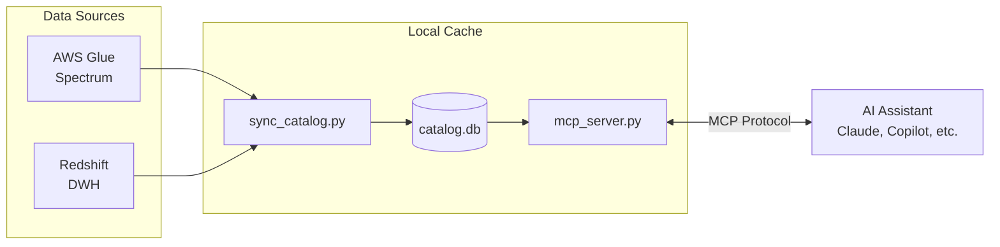

# Redshift query pilot
An AI agent skill that assists in generating optimized SQL queries for Amazon Redshift and Redshift Spectrum.

> **Disclaimer**: This code was generated by AI and briefly reviewed by a human. It was designed to run locally and has no tests. Feel free to use it as inspiration for your own SQL-assistance skills.

## What is this?

It's an AI Agent Skill designed to integrate with your favorite LLM-powered coding assistant (Claude Code, GitHub Copilot, Cursor, etc.) to help you write performant SQL queries. It provides:

- **Schema awareness** - The AI knows your table structures, column types, and relationships without you having to explain them
- **Partition optimization** - Automatic guidance on filtering partition keys to avoid expensive full S3 scans
- **Spectrum best practices** - Built-in knowledge of Redshift Spectrum limitations (read-only, no complex types in SELECT, nested data handling)
- **Query optimization tips** - Storage format awareness (Parquet vs JSON), predicate pushdown, and cost control

Instead of manually looking up table schemas or remembering Spectrum quirks, just ask your AI assistant to write a query and it will automatically look up the relevant schemas and apply best practices.

## How It Works

The tool consists of three components:

1. **Schema Sync** (`sync_catalog.py`) - Fetches table schemas from AWS Glue (Spectrum/Data Lake) and Redshift (Data Warehouse) and caches them in a local SQLite database. Must be run periodically to keep the cache up to date.
2. **MCP Server** (`mcp_server.py`) - Exposes the cached schemas to AI assistants via the [Model Context Protocol (MCP)](https://modelcontextprotocol.io/).
3. **LLM Skill** (`command.md`) - Custom instructions that teach the AI assistant how to write performant queries in Spectrum and Redshift, including partition filtering, predicate pushdown, and storage format optimization



## Installation

### Prerequisites

- Python 3.10+
- [uv](https://docs.astral.sh/uv/) (recommended) or pip
- AWS credentials configured (for Glue access, e.g., via `aws sso login`)

### Setup

```bash
# Clone the repository
git clone https://github.com/StuartApp/redshift-query-pilot.git
cd redshift-query-pilot

# Install dependencies
uv sync
```

### Sync the Schema Catalog

Run `sync_catalog.py` to fetch table schemas from AWS Glue and Redshift:

```bash
uv run python sync_catalog.py \
  --glue-database <your-glue-database> \
  --redshift-host <host> \
  --redshift-cluster <your-cluster> \
  --redshift-database <your-database> \
  --redshift-user <your-username> \
  --redshift-login-url <your-saml-idp-url>
```

**Required arguments:**

| Argument | Description |
|----------|-------------|
| `--glue-database` | AWS Glue database name to sync |
| `--redshift-host` | Redshift cluster endpoint |
| `--redshift-cluster` | Redshift cluster identifier |
| `--redshift-database` | Redshift database name |
| `--redshift-user` | Redshift username for SAML auth |
| `--redshift-login-url` | SAML IdP login URL for browser-based auth |

> **Note on Authentication**: Redshift sync uses browser-based SAML authentication. When you run the sync, a browser window will open for you to authenticate with your IdP (e.g., Okta). This is a one-time authentication per sync session. If you only need Glue schemas, use `--skip-redshift` to avoid the browser auth entirely.
>
> **Using different auth methods**: To use IAM authentication, basic username/password, or other methods, modify the `redshift_connector.connect()` call in the `sync_redshift()` function (`sync_catalog.py:164-175`). Refer to [redshift-connector documentation](https://github.com/aws/amazon-redshift-python-driver) for available authentication options.

**Optional arguments:**

| Argument | Default | Description |
|----------|---------|-------------|
| `-o, --output` | `./catalog.db` | SQLite output path |
| `--redshift-region` | `eu-west-1` | AWS region |
| `--skip-glue` | - | Skip Glue sync |
| `--skip-redshift` | - | Skip Redshift sync |
| `--saml-timeout` | `120` | SAML auth timeout in seconds |
| `-v, --verbose` | - | Enable debug logging |

**Glue-only sync** (no Redshift/SAML auth required):

```bash
uv run python sync_catalog.py --skip-redshift --glue-database <your-glue-database>
```

> **Note**: Re-run the sync periodically to keep the cache up to date when table schemas change.

### Configure the MCP Server

The MCP server exposes the schema catalog to your AI assistant. Configuration varies by client:

#### Claude Code

Register the server globally:

```bash
claude mcp add schema-catalog --scope user -- uv run --directory /path/to/redshift-query-pilot python mcp_server.py
```

Verify it's connected:

```bash
claude mcp list
```

Restart Claude Code after registration.

#### GitHub Copilot (CLI)

Edit `~/.copilot/mcp-config.json`:

```json
{
  "mcpServers": {
    "schema-catalog": {
      "command": "uv",
      "args": ["run", "--directory", "/path/to/redshift-query-pilot", "python", "mcp_server.py"]
    }
  }
}
```

Or use the interactive command within Copilot CLI: `/mcp add`

Restart your client after updating the configuration.

### Add the LLM Skill

Install custom instructions that teach the AI assistant about Redshift/Spectrum SQL syntax and best practices.

#### Claude Code - Global Skill

```bash
# Create the global commands directory if it doesn't exist
mkdir -p ~/.claude/commands

# Copy the instructions as a global skill
cp /path/to/redshift-query-pilot/command.md ~/.claude/commands/dwh.md
```

After installation, type `/dwh` in any Claude Code session to load the SQL assistant instructions.

#### GitHub Copilot - Global Instructions

```bash
# Create the global GitHub config directory if it doesn't exist
mkdir -p ~/.github

# Append instructions to Copilot's global instructions
cat /path/to/redshift-query-pilot/command.md >> ~/.github/copilot-instructions.md
```

## Usage

Once configured, simply ask your AI assistant to write SQL queries. It will automatically look up schemas and apply Spectrum best practices.

Example:
```
You: /dwh Write a query to get daily order counts for last week

AI: [Looks up schema for orders table]
    [Checks partition keys: year, month, day]
    [Generates optimized query with partition filters]
```

## Technical Reference

### Available MCP Tools

| Tool | Description |
|------|-------------|
| `search_tables` | Find tables by name/keyword, optionally filter by source (`glue` or `redshift`) |
| `get_table_schema` | Get full schema (columns, types, partition keys) for a specific table |
| `list_partition_keys` | List partition keys for a table with optimization tips |
| `find_columns` | Find tables containing a specific column name |
| `get_schema_mapping` | Get mapping between Glue databases and Redshift external schemas |

### Schema Sources

- **Glue** (`source: glue`): Spectrum external tables backed by S3. The sync paginates `get_tables` for a given database, extracting columns, partition keys, S3 locations, and storage formats (Parquet, ORC, CSV, JSON, Avro).

- **Redshift** (`source: redshift`): Internal Redshift tables. Connects via Browser SAML and queries `information_schema.tables` + `information_schema.columns`, filtering out system schemas. Running the sync will open a browser window for SAML authentication.

### Inspecting the Cache

```bash
# Count tables by source
sqlite3 catalog.db "SELECT source, database_name, COUNT(*) FROM tables GROUP BY source, database_name;"

# View sample table schemas
sqlite3 catalog.db "
  SELECT t.table_name, c.column_name, c.data_type, c.is_partition_key
  FROM tables t
  JOIN columns c ON t.id = c.table_id
  LIMIT 20;
"
```

### Environment Variables

| Variable | Description | Default |
|----------|-------------|---------|
| `CATALOG_DB_PATH` | Path to the SQLite catalog database | `./catalog.db` (relative to `mcp_server.py`) |
| `MCP_TOOL_TIMEOUT` | Timeout in seconds for tool operations | `30` |
