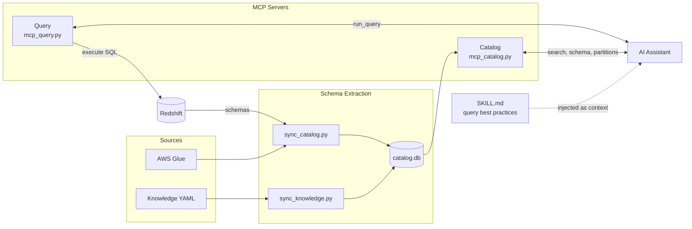

# Redshift query pilot
An AI agent skill that assists in generating optimized SQL queries for Amazon Redshift and Redshift Spectrum.

> **Disclaimer**: This code was generated by AI and briefly reviewed by a human. It was designed to run locally and has no tests. Feel free to use it as inspiration for your own SQL-assistance skills.

## What is this?

It's an AI Agent Skill designed to integrate with your favorite LLM-powered coding assistant (Claude Code, GitHub Copilot, Cursor, etc.) to help you write performant SQL queries. It provides:

- **Schema awareness** - The AI knows your table structures, column types, and relationships without you having to explain them
- **Partition optimization** - Automatic guidance on filtering partition keys to avoid expensive full S3 scans
- **Spectrum best practices** - Built-in knowledge of Redshift Spectrum limitations (read-only, no complex types in SELECT, nested data handling)
- **Query optimization tips** - Storage format awareness (Parquet vs JSON), predicate pushdown, and cost control

Instead of manually looking up table schemas or remembering Spectrum quirks, just ask your AI assistant to write a query and it will automatically look up the relevant schemas and apply best practices.

## Usage

Once configured, simply ask your AI assistant to write SQL queries. It will automatically look up schemas and apply Spectrum best practices.

Example:
```
You: /dwh Write a query to get daily order counts for last week

AI: [Looks up schema for orders table]
    [Checks partition keys: year, month, day]
    [Generates optimized query with partition filters]
```

## How It Works

The tool consists of three components, that can be used separately:

1. **Local Schema Extraction** — scripts to pull table metadata from Glue and Redshift into a local SQLite cache. Only needed if you don't already have a catalog (e.g., a central data catalog API). Contains:
   - **Schema Sync** (`sync_catalog.py`) — fetches schemas from AWS Glue and Redshift
   - **Knowledge Sync** (`sync_knowledge.py`) — adds table/column descriptions from YAML files

2. **MCP Servers** — Two independent [MCP](https://modelcontextprotocol.io/) servers exposing the schema catalog and query execution separately:
   - **Catalog server** (`mcp_catalog.py`) — lightweight, Redshift-free: schema lookup, table search, partition keys. Can be replaced by any remote catalog server that implements similar tools.
   - **Query server** (`mcp_query.py`) — bare `run_query` with Redshift connection management

3. **LLM Skill** (`SKILL.md`) — Custom instructions that teach the AI assistant how to write performant queries in Spectrum and Redshift, including partition filtering, predicate pushdown, and storage format optimization



## Installation

### 1. Install the LLM Skill

The skill teaches the AI assistant Redshift/Spectrum SQL syntax, partition optimization, and working with complex types.

**Claude Code:**
```bash
mkdir -p ~/.claude/skills/dwh
cp /path/to/redshift-query-pilot/SKILL.md ~/.claude/skills/dwh/SKILL.md
```
Claude Code auto-discovers skills from their descriptions. Invoke with `/dwh` or just describe your query task.

**opencode:**
```bash
mkdir -p ~/.config/opencode/skills/dwh
cp /path/to/redshift-query-pilot/SKILL.md ~/.config/opencode/skills/dwh/SKILL.md
```
Restart opencode to pick it up.

---

### 2. Sync the Schema Catalog & Install the Catalog MCP Server

Only needed if you don't already have a central catalog (e.g., a data catalog API). Skip this section if you do — just point the skill at your existing catalog.

Prerequisites: Python 3.10+ and [uv](https://docs.astral.sh/uv/) (or pip).

**Clone and install:**
```bash
git clone https://github.com/ericabertugli/redshift-query-pilot.git
cd redshift-query-pilot
uv sync
```

**A. Sync schemas from Glue and/or Redshift:**

```bash
# Glue-only (no Redshift auth needed):
uv run python sync_catalog.py --skip-redshift --glue-database <your-glue-database>

# With Redshift — SAML auth:
uv run python sync_catalog.py --glue-database <your-glue-database> --redshift-host <host> --redshift-cluster <cluster> --redshift-database <db> --redshift-user <user> --redshift-login-url <saml-url>

# With Redshift — user/password auth:
uv run python sync_catalog.py --glue-database <your-glue-database> --redshift-host <host> --redshift-database <db> --redshift-user <user> --redshift-password <password>
```

| Argument | Required | Description |
|----------|----------|-------------|
| `--glue-database` | Yes (unless `--skip-glue`) | AWS Glue database name |
| `--redshift-host` | Yes (unless `--skip-redshift`) | Redshift cluster endpoint |
| `--redshift-database` | Conditional | Redshift database name |
| `--redshift-user` | Conditional | Redshift username |
| `--redshift-password` | For user/password | Redshift password |
| `--redshift-login-url` | For SAML | SAML IdP login URL |
| `--redshift-cluster` | For SAML | Redshift cluster identifier |
| `--redshift-region` | No (default `eu-west-1`) | AWS region |
| `-o, --output` | No (default `./catalog.db`) | SQLite output path |
| `--skip-glue` | No | Skip Glue sync |
| `--skip-redshift` | No | Skip Redshift sync |

> **Note**: Re-run periodically to keep the cache up to date. SAML auth opens a browser window; user/password is non-interactive.

**B. Sync knowledge descriptions (optional):**

```bash
uv run python sync_knowledge.py -v
```
Knowledge files live in `knowledge/*.yml` (gitignored). See `knowledge/README.md` for the format.

**C. Register the catalog MCP server:**

The catalog server reads from the SQLite cache. No Redshift env vars needed.

**Claude Code:**
```bash
claude mcp add schema-catalog --scope user -- uv run --directory /path/to/redshift-query-pilot python mcp_catalog.py
```

**GitHub Copilot (CLI)** — add to `~/.copilot/mcp-config.json`:
```json
{
  "mcpServers": {
    "schema-catalog": {
      "command": "uv",
      "args": ["run", "--directory", "/path/to/redshift-query-pilot", "python", "mcp_catalog.py"]
    }
  }
}
```

**opencode** — add to `~/.config/opencode/opencode.json` / `.jsonc`:
```json
"mcp": {
  "schema-catalog": {
    "type": "local",
    "command": ["uv", "run", "--directory", "/path/to/redshift-query-pilot", "python", "mcp_catalog.py"],
    "enabled": true
  }
}
```

Restart your client after registering.

---

### 3. Install the Query MCP Server

Only needed if you want the AI to execute SQL directly against Redshift. Requires Redshift credentials.

If you haven't cloned the project yet:
```bash
git clone https://github.com/ericabertugli/redshift-query-pilot.git
cd redshift-query-pilot
uv sync
```

Register the server with Redshift connection env vars.

**Claude Code:**
```bash
# User/password:
claude mcp add schema-query --scope user \
  -e REDSHIFT_HOST=<host> \
  -e REDSHIFT_DATABASE=<db> \
  -e REDSHIFT_USER=<user> \
  -e REDSHIFT_PASSWORD=<password> \
  -- uv run --directory /path/to/redshift-query-pilot python mcp_query.py

# SAML:
claude mcp add schema-query --scope user \
  -e REDSHIFT_HOST=<host> \
  -e REDSHIFT_CLUSTER=<cluster> \
  -e REDSHIFT_DATABASE=<db> \
  -e REDSHIFT_USER=<user> \
  -e REDSHIFT_LOGIN_URL=<saml-url> \
  -- uv run --directory /path/to/redshift-query-pilot python mcp_query.py
```

**GitHub Copilot (CLI)** — add to `~/.copilot/mcp-config.json`:
```json
{
  "mcpServers": {
    "schema-query": {
      "command": "uv",
      "args": ["run", "--directory", "/path/to/redshift-query-pilot", "python", "mcp_query.py"],
      "env": {
        "REDSHIFT_HOST": "your-cluster.region.redshift.amazonaws.com",
        "REDSHIFT_DATABASE": "your_db",
        "REDSHIFT_USER": "your_user",
        "REDSHIFT_PASSWORD": "your_password"
      }
    }
  }
}
```

**opencode** — add to `~/.config/opencode/opencode.json` / `.jsonc`:
```json
"mcp": {
  "schema-query": {
    "type": "local",
    "command": ["uv", "run", "--directory", "/path/to/redshift-query-pilot", "python", "mcp_query.py"],
    "enabled": true,
    "environment": {
      "REDSHIFT_HOST": "your-cluster.region.redshift.amazonaws.com",
      "REDSHIFT_DATABASE": "your_db",
      "REDSHIFT_USER": "your_user",
      "REDSHIFT_PASSWORD": "{env:REDSHIFT_PWD}"
    }
  }
}
```

Restart your client after registering.

## Technical Reference

### Available MCP Tools

| Server | Tool | Description |
|--------|------|-------------|
| schema-catalog | `search_tables` | Find tables by name/keyword, optionally filter by source (`glue` or `redshift`) |
| schema-catalog | `get_table_schema` | Get full schema (columns, types, partition keys) for a specific table. Includes knowledge-base descriptions when available |
| schema-catalog | `list_partition_keys` | List partition keys for a table with optimization tips |
| schema-catalog | `find_columns` | Find tables containing a specific column name |
| schema-catalog | `get_schema_mapping` | Get mapping between Glue databases and Redshift external schemas |
| schema-catalog | `get_field_descriptions` | Get detailed table/column descriptions from knowledge YAML files |
| schema-query | `run_query` | Execute a SQL query against Redshift and return results (SELECT, CTEs, CREATE TEMP TABLE) |

### Environment Variables

| Variable | Description | Default |
|----------|-------------|---------|
| `CATALOG_DB_PATH` | Path to the SQLite catalog database | `./catalog.db` |
| `MCP_TOOL_TIMEOUT` | Timeout in seconds for tool operations | `30` |
| `REDSHIFT_HOST` | Redshift cluster endpoint (required for `run_query`) | - |
| `REDSHIFT_CLUSTER` | Redshift cluster identifier (required for SAML auth) | - |
| `REDSHIFT_DATABASE` | Redshift database name (required for `run_query`) | - |
| `REDSHIFT_USER` | Redshift username | - |
| `REDSHIFT_PASSWORD` | Redshift password (for user/password auth) | - |
| `REDSHIFT_REGION` | AWS region | `eu-west-1` |
| `REDSHIFT_LOGIN_URL` | SAML IdP login URL (for SAML auth) | - |
| `REDSHIFT_QUERY_TIMEOUT` | Query execution timeout in seconds | `60` |
| `REDSHIFT_MAX_ROWS` | Default max rows returned by `run_query` | `1000` |


